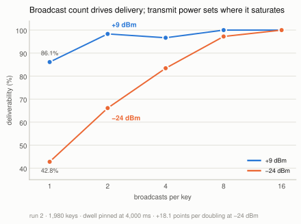
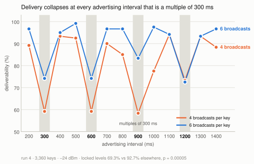
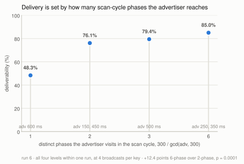
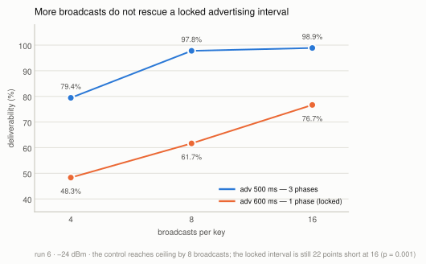
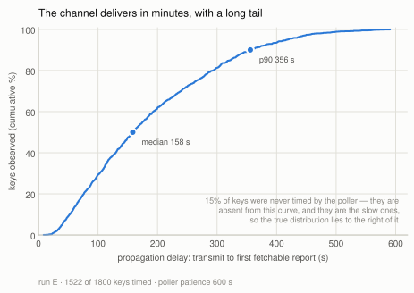
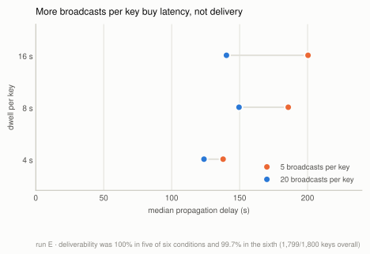
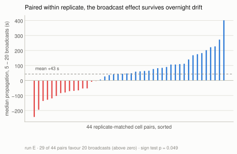
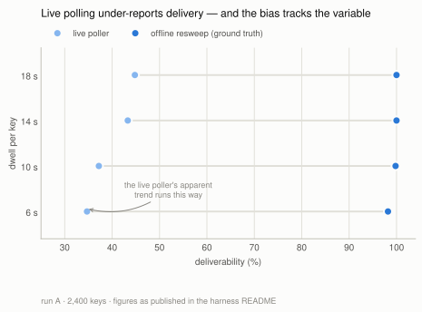

# Characterising a crowd-sourced BLE relay as a data channel

**An experimental report on the `sendmy` one-way channel**

Nguyen Thai Binh · CP2107 · August 2026

---

## Summary

`sendmy` sends data from a BLE-only device by encoding payload bytes into the
rotating public keys of a crowd-sourced location-relay network: nearby phones
observe the beacon, upload an encrypted location report keyed by the advertised
key, and the sender's owner fetches those reports back. This report
characterises that channel experimentally — how much gets through, how fast, and
which transmitter parameters matter.

Eleven automated matrix runs on an ESP32 — 24,337 transmitted keys at a single
urban site — support five findings:

1. **The channel is effectively lossless at urban density and full transmit
   power.** Ground-truth deliverability was 99.5%, 99.8% and 99.94% across three
   full-power runs, with **zero payload corruption in any run**.
2. **Broadcast count is what delivery depends on** — not how long a key is held
   on air. At the −24 dBm power floor delivery rises **+18.1 points per doubling**
   of broadcasts per key, from 42.8% at one broadcast to 100% at sixteen, while
   dwell from 1 s to 8 s is flat at two different power levels.
3. **Transmit power sets where that curve saturates**, rather than shifting
   delivery uniformly: +9 dBm reaches 98% by two broadcasts; −24 dBm needs eight.
4. **Some advertising intervals are simply bad, and more broadcasts do not fix
   them.** Delivery collapses at every interval that is a **multiple of 300 ms**
   — 69.3% against 92.7% elsewhere (p = 0.00005) — in a comb that a coarse sweep
   steps straight over. Delivery is set by how many distinct phases of a 300 ms
   cycle the advertiser reaches, `300 / gcd(adv, 300)`, and a locked interval is
   still 22 points below its control at 16 broadcasts per key (p = 0.001). Read
   the other way, this is a measurement of the **relay scanner's duty cycle**
   inferred entirely from delivery statistics.
5. **The channel's real cost is latency, not loss** — median 158 s from
   transmission to a fetchable report, p90 355 s, with a tail past 9 minutes.
   More broadcasts also buy latency: 4× more moved the median 40 s earlier.

A fifth, methodological result is arguably the most transferable: **live
detection polling systematically under-reports deliverability, and the bias
correlates with the independent variable**, manufacturing a plausible but false
parameter trend. Deliverability must be read from an offline sweep. This is
documented in §7 because it invalidated the first run's headline numbers and
changed how every subsequent run was instrumented.

---

## 1. Method

### 1.1 Harness

The board is flashed once with reconfigurable firmware that reads `run key=val`
commands over the console UART, so an entire experiment matrix runs unattended
from a single flash. Each *cell* of a matrix is one parameter combination; each
*window* within a cell advertises one payload octet under one derived carrier
key (`mid`). The two swept transmitter parameters are the **advertising
interval** (`adv_ms`, how often the radio re-broadcasts the current key) and the
**dwell** or rotation interval (`upd_ms`, how long a key is held before rotating
to the next). Their ratio fixes a third, derived quantity used throughout:
**broadcasts per key** = `upd_ms / adv_ms`.

### 1.2 Ground truth

What was sent is known two independent ways — reproduced from the cell's
parameters (all payload modes are deterministic) and parsed from the firmware's
serial log — and the harness reconciles them, warning on disagreement. What was
*received* is recovered by fetching reports for each key.

**Deliverability is always taken from an offline resweep**, not from the live
poller, for the reasons in §6. The resweep re-fetches every key after the run
with no queue pressure and a generous time window.

### 1.3 Controls

- **Per-cell UIDs.** Every cell gets a fresh 32-byte Unilink ID, so cells cannot
  contaminate each other's key space.
- **Interleaving.** Cells are ordered round-robin across conditions, so a block
  of *k* consecutive cells covers all *k* conditions once. Overnight drift in
  ambient device density is therefore balanced across conditions rather than
  confounded with them.
- **Density logging.** A parallel BLE scanner samples ambient finder density
  throughout each run, so "the network was empty" can be distinguished from "the
  network dropped it."
- **Cell-clustered inference.** A cell's 20 keys are not independent samples, so
  significance tests are permutation tests at the cell level, or paired tests on
  cell-level medians.

### 1.4 Runs

| Run | Cells × windows | Swept | Duration |
|---|---|---|---|
| A. Throughput | 120 × 20 = 2400 | dwell 6/10/14/18 s @ adv 1 s | overnight |
| B. TX × rotation | 120 × 20 = 2400 | TX −12…−24 dBm × rotation 4/8/16 s | overnight |
| C. Advertising | 120 × 20 = 2400 | adv 100…4000 ms @ dwell 8 s | ~5.4 h |
| D. Static soak | 3 × 110 min | nothing (continuity probe) | ~5.5 h |
| E. Dwell factorial | 90 × 20 = 1800 | dwell 4/8/16 s × broadcasts 5/20 | ~4.9 h |
| 1. TX × dwell | 98 × 20 = 1960 | TX {+9, −24 dBm} × dwell 2/4/8 s | ~2.7 h |
| 1b. TX × dwell, no antenna | 98 × 20 = 1960 | same, antenna removed | ~2.7 h |
| 2. Broadcasts × TX | 99 × 20 = 1980 | broadcasts 1/2/4/8/16 × TX {+9, −24 dBm} | ~2.8 h |
| 3. Sub-4 s dwell | 165 × 20 = 3300 | dwell 1/2/3/4/6 s @ −24 dBm | ~4.5 h |
| 4. Fine `adv` sweep | 168 × 20 = 3360 | adv 200…1400 ms × broadcasts {4, 6} @ −24 dBm | ~4.9 h |
| 6. Comb follow-up | 138 × 20 = 2760 | off-grid adv {150…450} × {4, 6}; adv {500, 600} × {4, 8, 16} | ~2.7 h |

Runs A–E are the exploratory corpus; runs 1–4 are a controlled **series** sharing
one instrument configuration and a common anchor condition (`a###_ref`,
~7–10% of every run), which is what makes them comparable across nights. Anchors
read 99.4 / 99.4 / 100.0 / 99.6 / 100.0% in runs 1–4 and 6 — the instrument check that licenses
pooling. Runs 1b, 2, 3 and 4 are the only ones with a full-power *and* an
attenuated arm, and that headroom is why they can see effects that runs A–E,
saturated at ceiling, could not.

---

## 2. The channel is effectively lossless at urban density

Ground-truth deliverability, offline resweep:

| Run | Keys | Delivered | Deliverability |
|---|---|---|---|
| A. Throughput | 2400 | 2388 | 99.5% |
| C. Advertising | 2400 | 2395 | 99.8% |
| E. Dwell factorial | 1800 | 1799 | **99.94%** |
| B. TX × rotation (attenuated) | 2400 | 2169 | 90.4% |

Run E's full 3 × 2 factorial:

| dwell \ broadcasts per key | 5 | 20 | row |
|---|---|---|---|
| 4 s | 300/300 | 300/300 | 100% |
| 8 s | 300/300 | 300/300 | 100% |
| 16 s | 299/300 | 300/300 | 99.83% |
| **column** | **99.89%** | **100%** | **99.94%** |

One key lost out of 1800, across every condition, over five hours. Separately,
**every delivered payload was byte-correct** — 1799/1799 in run E, and no
correctness failure has been observed in any run. The relay does not silently
corrupt; a key either comes back or it does not.

The consequence for the rest of this report is that **every transmitter
parameter swept turned out not to matter for delivery at this density**. That is
the finding, not an absence of one: the constraint on this channel is not the
radio link. But it also means the runs are saturated, and the interesting
regimes — sparse density, weak signal, sub-second dwell — sit outside what has
been measured (§8).

---

## 3. Broadcast count drives delivery; power sets where it saturates

Runs A–E could not answer what delivery depends on, because at full transmit
power every condition sat at ceiling. Run 2 re-ran the question with headroom:
dwell pinned at 4,000 ms throughout, broadcasts per key stepped 1 → 16 by
varying `adv`, crossed with transmit power at {+9, −24 dBm}.



*Figure 1 — At the −24 dBm power floor delivery climbs from 42.8% to 100% across
the broadcast axis. At +9 dBm the same curve is already saturated by two
broadcasts. Dwell is constant everywhere on this plot.*

| broadcasts/key | 1 | 2 | 4 | 8 | 16 |
|---|---|---|---|---|---|
| +9 dBm | 86.1% | 98.3% | 96.7% | 100% | 100% |
| −24 dBm | 42.8% | 66.1% | 83.3% | 97.2% | 100% |

**+18.1 points per doubling at −24 dBm, +4.0 at +9 dBm, both p < 0.0001.**

This closes the project's central confound. An earlier run had reported
80 / 92 / 99% at 4 / 8 / 16 s of dwell and attributed the effect to dwell — but
it pinned `adv` at 2,000 ms, so its dwell levels were simultaneously 2 / 4 / 8
broadcasts per key. Run 2's −24 dBm arm reproduces that curve at 66 / 83 / 97%
from broadcast count alone, with dwell held fixed. Meanwhile runs 1 and 3 moved
dwell with broadcasts pinned and found it flat from 1 s to 8 s, the second time
at ~50% delivery where a ceiling cannot explain the flatness.

**Transmit power does not shift the curve, it sets where the curve saturates.**
This also narrows an earlier "TX power does not matter" result, which swept only
−12…−24 dBm with no full-power arm and so measured flatness *inside the
attenuated tail* (§8).

**Operating point: at least 8 broadcasts per key; 16 for full delivery at the
power floor.**

---

## 4. Some advertising intervals are simply bad

Run 3 swept dwell below 4 s at −24 dBm and found no floor — 1 s dwell was the
*best* level at 91.7%, killing the scan-duty-cycle hypothesis it was built on.
But the result was non-monotone, and regrouping by advertising interval split it
exactly: `adv` ∈ {200, 400, 800} delivered 90.7% against 68.1% at {600, 1200},
a 22.6-point gap at p < 0.0001. That design pinned `adv = dwell/5`, leaving the
two perfectly confounded, so run 4 separated them: `adv` swept 200–1400 ms in
100 ms steps, crossed with **two** broadcast counts, 4 and 6.



*Figure 2 — The penalty is periodic, not a single resonance, and it lands at the
same advertising intervals in both broadcast arms.*

| | deliverability | keys |
|---|---|---|
| `adv` ∈ {300, 600, 900, 1200} | **69.3%** | 665/960 |
| all other `adv` | **92.7%** | 2003/2160 |

**23.5 points, p = 0.00005** (cell-clustered permutation, 20,000 shuffles),
present independently in both arms: 62.5% vs 89.3% at 4 broadcasts, 76.0% vs
96.2% at 6.

**It is an advertising-interval effect, not a dwell effect.** Because
`broadcasts = dwell / adv`, only two of the three can be fixed; running two
broadcast counts makes dwell differ between the arms at any given `adv`
(4 broadcasts: 1200/2400/3600/4800 ms; 6 broadcasts: 1800/3600/5400/7200 ms).
A dwell-driven penalty would therefore appear at *different* `adv` in each arm.
It does not — it lands on the same comb in both. Run 3's 600 and 1200 ms dips
were two points on that comb.

**Leading hypothesis: phase locking against a duty-cycled scanner.** Not channel
aliasing — in legacy BLE one advertising *event* transmits on channels 37, 38
and 39 within a few milliseconds, so a scanner parked on any one channel hears
every event, and channel rotation cannot produce a comb. What can is
commensurability with the scanner's **scan interval** `S`. Relays duty-cycle:
a scan window inside a scan interval. If `adv` is an exact multiple of `S`, every
advertising event lands at the same phase relative to that window, so a phase
falling in dead time means the scanner never hears the device for the whole
dwell, however many events are sent. Taking `S` = 300 ms, the number of distinct
phases visited is `S / gcd(adv, S)`:

| `adv` | `gcd(adv, 300)` | phases visited | observed |
|---|---|---|---|
| 300, 600, 900, 1200 | 300 | **1** | **penalised** |
| 200, 400, 500, 700, 800, 1000, 1100, 1300, 1400 | 100 | 3 | clean |

One free parameter fits all thirteen levels. It predicts the arm difference too:
the BLE spec's mandatory 0–10 ms random `advDelay` per event gives the phase a
slow random walk, so more broadcasts mean more chances to escape a dead phase —
which is why 6 broadcasts beats 4 at precisely the penalised levels and nowhere
else. And it contradicts nothing already measured: run C swept `adv` at
100/250/500/1000/2000/4000 ms, whose gcds with 300 are 50 or 100, so it stepped
over every bad interval by luck and concluded "duty cycle is nearly free" —
true at those six intervals, false in general.

**Run 6 tested the model's two sharpest predictions and both held.** It swept
`adv` off the 100 ms grid — 150, 250, 350, 450 ms — and separately walked
broadcast count at one locked interval and one control. 138 cells / 2760 keys,
anchors 240/240 = **100.0%**.

*Prediction 1: the response should be graded by phases visited, not binary.* Run
4's grid forced `gcd(adv, 300)` to be 100 or 300, so it could only ever separate
one phase from three. Run 6 contains all four phase counts internally, at a
matched broadcast count:



| phases visited | 1 | 2 | 3 | 6 |
|---|---|---|---|---|
| `adv` (ms) | 600 | 150, 450 | 500 | 250, 350 |
| delivered | 48.3% | 76.1% | 79.4% | **85.0%** |

*Figure 3 — Monotone in phases visited and saturating between three and six.
6-phase over 2-phase is +12.4 points, p = 0.0001.*

*Prediction 2: 450 ms discriminates the scan interval.* Under `S` = 300 it visits
2 phases and should be intermediate; under `S` = 150 it is a multiple of the scan
interval and should be **fully locked**. It came back intermediate — 75.6%,
alongside 150 ms at 78.9% — which favours a 300 ms cycle.

**But the penalty does not escape with broadcast count**, and that changes the
practical rule:



| broadcasts/key | 4 | 8 | 16 |
|---|---|---|---|
| `adv` 500 ms (3 phases) | 79.4% | 97.8% | **98.9%** |
| `adv` 600 ms (1 phase) | 48.3% | 61.7% | **76.7%** |
| gap | +31.1 | +36.1 | **+22.2** |

*Figure 4 — The control reaches ceiling by 8 broadcasts; the locked interval is
still 22 points short at 16 (p = 0.001).*

This is consistent with the model rather than against it. The random walk from
`advDelay` advances phase by ~5 ms per event on average, so 16 events buy roughly
80 ms of drift against a ~300 ms cycle — sixty-odd events would be needed to
traverse it. The escape is real but far slower than 16 broadcasts can deliver.
**The consequence is that the broadcast-count rule and the advertising-interval
rule are independent constraints: satisfying §3 does not rescue a locked
interval.**

### What this says about the relay scanner

Read in reverse, these results are a measurement of the scanning devices —
inferred entirely from delivery statistics, with no access to the phones.

- **The scan schedule is periodic, with a 300 ms fundamental.** A comb requires a
  clock; jittered scan starts would erase it.
- **Scan phase is stable across the whole dwell**, up to ~10 s here. A scanner
  re-randomising its offset each cycle would average out within a few events.
- **The scanner population shares that cadence.** Around ten independent
  strangers' devices were present. Heterogeneous scan intervals would make one
  device's resonance another's drift and smear the comb away; its sharpness
  implies a single OS-level schedule rather than per-app scanning.
- **The scarce resource is scan *time*, not channel coverage.** A legacy
  advertising event covers 37, 38 and 39 within milliseconds, so the bottleneck
  can only be that the scanner is asleep most of the time.
- **Phase offsets are distributed across devices, not aligned.** A fully locked
  advertiser still delivers 48%; if every phone woke on a shared boundary it
  would deliver near zero. A "locked" transmitter is only locked against the
  subset of phones whose window it misses.
- **The duty cycle is substantial, not tiny.** Coverage nearly saturates by three
  phases. A window of a few percent of the interval would show a long climb from
  3 to 6 phases; the plateau puts it at order tens of percent. No point estimate
  is offered: delivery needs only one of ~10 phones to hear a key, so the map
  from per-scanner hit probability to observed delivery saturates and cannot be
  inverted without modelling the population.

**What remains unproven.** 300 ms is the period of the resonance, not necessarily
the scan interval — a 600 ms interval with two windows per cycle, or 150 ms with
alternate windows skipped, would look identical from here. A weak `advDelay` on
the ESP32 would deepen locking without creating it, so the transmitter is not
fully excluded. And a test for overdispersion at penalised levels was
inconclusive (3.03× binomial against 3.74× at clean levels), as expected once 20
keys are pooled across scanners with independent phases. §9 gives the experiment
that would pin the duty cycle rather than bound it.

**Practical rule, combined with §3: use at least 8 broadcasts per key, *and*
never choose an advertising interval that is a multiple of 300 ms.** These are
independent requirements — run 6 shows raising broadcast count does not buy your
way out of a bad interval. Neighbouring intervals are fine: 500 ms reaches 98.9%
at the same broadcast count where 600 ms manages 76.7%.

**One caveat on absolute numbers.** Run 6 ran sparser than run 4 (median 10
finders against 16), and its `adv` 500 / 4-broadcast cell reads 79.4% against run
4's 92.5% for the same condition, while anchors were 100% in both. The anchor
condition is too strong to register a shift that moves fragile cells 13 points.
Every claim above is a within-run contrast; cross-run absolute rates should not
be quoted.

---

## 5. The cost is latency, and it is heavy-tailed

Define **propagation delay** as the interval from transmitting a key to the
moment a report for it first becomes fetchable. This is the channel's true
end-to-end delay, and it is the quantity a system built on `sendmy` must design
around. The estimate below comes from run E alone — latency distributions from
different runs are not comparable, for reasons given in §7.



*Figure 5 — Propagation delay over the 1,522 run-E keys the poller timed.*

| min | p25 | **p50** | p75 | **p90** | p99 | max |
|---|---|---|---|---|---|---|
| 9 s | 89 s | **158 s** | 265 s | **355 s** | 504 s | 591 s |

**The channel is ~100% reliable but delivers on the order of minutes**, with a
tail running past 9 minutes. Half of all keys need more than 2.5 minutes; one in
ten needs more than 6. Any application design that assumes seconds is wrong about
this channel; the right mental model is store-and-forward mail, not a link.

**Every number in that table is a lower bound.** The poller timed 1,522 of run
E's 1,800 keys; the other 15% were abandoned before a report appeared and are
absent from the curve rather than recorded as slow. Since the abandoned keys are
by construction the slow ones, the true median and p90 are both higher than
measured, and the measured maximum of 591 s is an artifact of 600 s of poller
patience rather than a property of the network. **This bias is a property of the
instrument, not of the channel** — it is the same mechanism that invalidated an
earlier run's headline deliverability figures, and it is treated in full in §7.

Two secondary observations from the same data: the median horizontal accuracy of
the decrypted location fixes was 87 m, and delivered goodput at these settings
ranged from 3.7 keys/min (16 s dwell) to 14.8 keys/min (4 s dwell) — 0.062 to
0.246 bit/s, which frames the channel's realistic scale.

---

## 6. Broadcast count also buys latency

Run E was designed to separate two variables that prior runs had confounded: how
*long* a key is on air (dwell) and how *often* it repeats (broadcast count). It
crossed dwell 4/8/16 s with broadcasts-per-key 5/20, scaling `adv_ms` with dwell
so that the broadcast count is held constant *within* each dwell level — an
iso-broadcast design. 15 replicates per condition, round-robin interleaved.

Delivery, as §2 shows, was at ceiling in all six conditions, so the design could
not discriminate on its primary endpoint. It discriminated cleanly on latency:



*Figure 6 — At every dwell level, more broadcasts per key means a lower median
propagation delay, while delivery stays pinned at the ceiling.*

| | broadcasts = 5 | broadcasts = 20 |
|---|---|---|
| median propagation | 178 s | **138 s** |
| poller coverage (by dwell 4/8/16 s) | 66 / 81 / 92% | 85 / 97 / 87% |

- Pooled per-key: **Δ median = 40 s**, permutation test **p < 0.0001**.
- Paired by replicate on cell medians (which removes overnight drift entirely):
  29 of 44 pairs favour the denser broadcast, mean Δ 43 s, **sign test
  p = 0.049**.



*Figure 7 — The paired test in full. The effect is a shifted distribution, not a
uniform one: 15 of 44 pairs run the other way, and the mean is carried partly by
a long positive tail.*

The censoring in §5 works *against* this effect: the sparse arm loses more of its
slow tail to the poller cut-off, which biases its measured median *downward*. So
40 s is a floor on the true difference.

Dwell showed no clean latency ordering (medians 131 / 175 / 166 s at 4 / 8 / 16 s;
8 vs 16 s, p = 0.40), and in this design dwell co-varies with `adv_ms` by
construction, so no dwell effect on latency should be read from it.

**Interpretation.** *In this run* more broadcasts did not make delivery more
likely — they made it happen sooner, by raising the chance that a *passing*
finder intersects a broadcast early in the key's dwell window rather than late.
The "not delivery" half of that is now known to be a ceiling artifact: run E was
conducted at full transmit power, where delivery is saturated and cannot move.
Given headroom, broadcast count moves delivery hard (§3). The latency result
below stands; read it as *broadcast count buys latency as well as delivery*. This is a useful
separation, because deliverability and latency are routinely conflated when
tuning BLE beacons, and here they respond to different knobs. Run C reported no latency
ordering with `adv_ms`, but that null carries no weight: its per-level coverage
ran from 94% down to 45% along that very axis (§7), so it was measuring a
differently-selected subset at each level.

---

## 7. Methodological result: live polling lies

The first run (A) produced a clean, plausible, and entirely false result.

Its live poller — fetching every 30 s and abandoning a key once
`now − send_time > lost_timeout · queue_soft_cap / queue_size` — reported 40.0%
deliverability, rising monotonically with dwell:

| dwell | live | **true (offline)** |
|---|---|---|
| 6 s | 34.7% | 98.2% |
| 10 s | 37.2% | 99.8% |
| 14 s | 43.3% | 100% |
| 18 s | 44.8% | 100% |
| **all** | **40.0%** | **99.5%** |



*Figure 8 — The gap between the two measurements is the artifact. It is widest at
the shortest dwell, which is exactly where the hypothesis under test predicted a
real deficit.*

True deliverability was 99.5% and flat. The live figure was a sampling artifact:
the adaptive timeout collapses under backlog (queue of 40 → 144 s effective
patience; queue of 60 → 96 s) to well below the real p90 propagation of ~256 s,
so slow-but-real keys were abandoned before their reports existed. The live
poller logged *zero* detections for 18 of 120 cells; the offline resweep
recovered ~20/20 for every one of them.

Critically, **the bias was correlated with the independent variable**. Short
dwell packs more keys per unit time, so it produced the largest queue backlog and
the worst under-count. The artifact therefore ran in exactly the direction a
"longer dwell delivers better" hypothesis predicts, and it would have been
reported as a real effect had the offline sweep not been run.

The general form of this failure — *the instrument's timeout is shorter than the
phenomenon's tail, and the load that shortens the timeout is the thing being
varied* — is not specific to this protocol. Any adaptive-timeout measurement of a
heavy-tailed process is exposed to it.

The fix was a **two-tier poller** (a fast tier for propagation timing, a slow
sweep for deliverability) plus a mandatory offline resweep for ground truth.
Validation: in run C, live and offline deliverability agreed to within one key at
every level, and run E's live and offline counts agreed exactly.

**The same bias survives in the latency measurements, and it is why §5 reports
one run rather than several.** Deliverability was rescued by the offline resweep;
propagation delay cannot be, because a report fetched hours later carries no
record of when it first became available. So every latency figure in this report
is computed over whichever keys the poller happened to catch, and that subset is
selected for speed. The effect is large and it differs between runs:

| | run C | run E |
|---|---|---|
| poller patience | 300 s | 600 s |
| queue soft cap | 16 | 32 |
| **keys timed** | **1572 / 2400 = 66%** | **1522 / 1800 = 85%** |
| observed median | 92 s | 158 s |

Run C looks nearly twice as fast, but its median is the median of its fastest
66%. Censoring run E's distribution at 300 s to match brings its median from
158 s to 131 s — closing about half the gap — and the rest is explained by C
running at a higher average broadcast count and slightly higher finder density,
both of which genuinely reduce delay (§6).

Within run C the selection is worse still, because **coverage varies along the
independent variable**:

| adv (ms) | 100 | 250 | 500 | 1000 | 2000 | 4000 |
|---|---|---|---|---|---|---|
| broadcasts/key | 80 | 32 | 16 | 8 | 4 | 2 |
| **keys timed** | **94%** | 89% | 59% | 53% | 54% | **45%** |
| observed median | 94 s | 76 s | 85 s | 108 s | 97 s | 109 s |

Those medians look flat, and run C reported them as showing no latency ordering
with `adv`. They are not comparable to one another: the sparse levels appear fast
because only their fast keys were captured. This is the same failure as run A's —
sampling loss correlated with the variable under test, manufacturing a plausible
flat line — and it means run C could not have detected a latency ordering in
either direction.

---

## 8. Corrections to earlier conclusions

Four claims from earlier in this project have been narrowed or withdrawn.
Recording them is part of the result.

**"Dwell, not broadcast rate, is what delivery depends on." — withdrawn, and
inverted.** It rested on comparing 4 s dwell at 80% against 8 s dwell at 99%
*across different runs, nights and densities*, in a design where `adv` was pinned
so dwell and broadcast count moved together. Run 2 separated them and found
broadcast count carries the effect (§3); runs 1 and 3 moved dwell with broadcasts
pinned and found it flat from 1 s to 8 s at two power levels.

**"TX power does not matter." — narrowed.** Run B swept −12 to −24 dBm and found
deliverability flat (p = 0.94), but *every arm was attenuated*, so it established
flatness **within the attenuated tail**. With a full-power arm added, +9 dBm
delivers 96.1% against −24 dBm's 89.0% (p = 0.0009), and the mechanism is
saturation of the broadcast curve rather than a uniform shift.

**"Radio duty cycle is nearly free." — narrowed to the levels it tested.** Run C
found ~100% delivery across `adv` 100–4000 ms, but every level it sampled is
coprime enough with 300 ms to avoid the comb (§4). The claim is true at those six
intervals and false in general.

**"Antenna removal can serve as an attenuation dial." — withdrawn.** Run 1b
repeated run 1 with the antenna off and found a regime switch, not a dial:
0 of 900 keys delivered at −24 dBm against 49.8% at +9 dBm. Attenuation must come
from the PA setting with the antenna fitted.

A methodological correction belongs here too. **Deliverability must be read from
an offline resweep, and the resweep must be run at least 2 hours after
transmission ends.** Run 4's first sweep was launched about a minute after the
final cell and reported 29.6% for keys sent in the last hour, against 87–91% for
everything older; re-swept at +3.1 h the same keys read 76.1% while every older
bucket returned byte-identical counts. Earlier runs swept at +1.3–1.7 h and carry
a residual few-point bias confined to their final cells.

---

## 9. Limitations and what remains open

Experimental work on this system is complete; what follows is what the corpus
does not establish, stated so the results are not read past their support.

**Limitations.**

- **Single site, single receiver network, single transmitter.** Every number is
  "at urban Singapore density, on one ESP32." The comb in particular would be far
  stronger if it reproduced on different hardware, because that is exactly what
  separates a relay-network property from a controller property.
- **Density was never manipulated.** Ambient finder counts ran 6–31 across the
  corpus as a nuisance variable, not a treatment. The channel under genuine
  scarcity — the regime a real deployment cares about — is uncharacterised. A
  density matrix was built but not run: the available site reads 10.6–13.5 mean
  finders across the whole day with within-hour scatter of 3–23, so its noise is
  several times its diurnal signal and a run there would have produced a flat
  line regardless of the truth. Doing it properly needs a venue with real footfall
  variation, regimes persisting 30+ minutes, and a low → high → low reversal so
  density is not confounded with elapsed time.
- **Latency figures are lower bounds** set by poller patience, and unlike
  deliverability they cannot be recovered by re-analysis (§7). Fixing them
  requires re-running with more patient polling, not reprocessing.
- **Anchors detect a bad night but cannot calibrate one.** The anchor condition
  (+9 dBm, 8 broadcasts) sits at ceiling by design, so it is insensitive to
  shifts that move fragile cells substantially — runs 4 and 6 both read ~100% on
  anchors while a shared condition moved 13 points between them. Within-run
  contrasts are sound; cross-run absolute rates are not.
- **Board position is an uncontrolled covariate**, and diurnal drift is balanced
  by interleaving rather than controlled.

**What would settle the scanner model.** §4 bounds the scanner's duty cycle but
does not pin it. Two experiments would:

1. **A long-dwell escape measurement** — `adv` 600 ms at 32, 64 and 128
   broadcasts per key. The model puts the escape at sixty-odd events, so delivery
   should climb back to control levels somewhere in that range. The broadcast
   count at which it recovers gives the phase drift rate directly, and drift rate
   together with notch depth is enough to compute the scan window rather than
   bound it. This is the single most informative run left undone.
2. **Notch width** — `adv` swept in 5–10 ms steps across 590–610 ms. How far off
   600 ms the penalty persists measures how tightly phase must match, which is a
   second, independent route to the same window estimate.

Both are cheap — a few hours each — and neither needs a new site or new hardware.

**What would generalise it.** A second transmitter of a different make, and a
repeat at full transmit power: the comb was characterised only at −24 dBm, where
delivery has headroom. Whether it survives at +9 dBm, where delivery is otherwise
saturated, determines whether it constrains real deployments or is a curiosity of
the attenuated regime.

---

## Appendix: reproducing the analysis

```sh
cd examples/espbench

# run a matrix (unattended; board flashed once)
python3 run_matrix.py matrix.dwell_isobroadcast.json

# authoritative deliverability — never use the live poller's counts
python3 scripts/resweep.py results/<run>/

# cell-clustered significance tests
python3 scripts/analyze.py   results/<run>/
python3 scripts/analyze2d.py results/<run>/ --resweep --final

# regenerate every figure in this report (SVG + 200 dpi PNG)
scripts/.venv/bin/python scripts/plot_report.py
```

Host dependencies are pinned in `scripts/requirements.txt`
(`scripts/.venv/bin/python -m pip install -r scripts/requirements.txt`).
Figures 1–4 are derived directly from the run artifacts; figure 5 uses run A's
published figures, since that run's artifacts were not retained.

Per-run artifacts: `summary.json` (per-key detail, including every report's
timestamp, decrypted fix and propagation latency), `summary.csv` (per-cell
aggregates), `resweep.csv` (ground-truth deliverability), `density.csv` (ambient
finder density time-series), `detection.csv` / `deliverability.csv` (raw poller
series). Full harness documentation is in `examples/espbench/README.md`.
