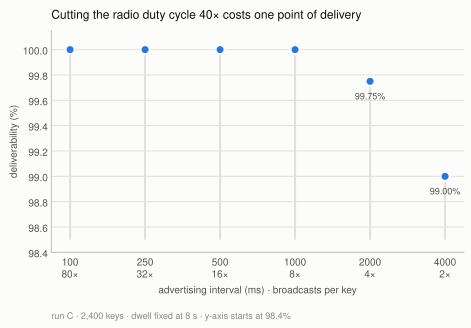

# Characterising a crowd-sourced BLE relay as a data channel

**An experimental report on the `sendmy` one-way channel**

Nguyen Thai Binh · CP2107 · August 2026

---

## Summary

`sendmy` sends data from a BLE-only device by encoding payload bytes into the
rotating public keys of a crowd-sourced location-relay network: nearby phones
observe the beacon, upload an encrypted location report keyed by the advertised
key, and the sender's owner fetches those reports back. This report
characterises that channel experimentally — how much gets through, how fast, and
which transmitter parameters matter.

Five automated overnight matrix runs on an ESP32 (~9,000 transmitted keys, single
urban site) support four findings:

1. **The channel is effectively lossless at urban density.** Ground-truth
   deliverability was 99.5%, 99.8% and 99.94% in the three runs measured at full
   transmit power, with **zero payload corruption in any run**.
2. **Radio duty cycle is nearly free.** Cutting broadcasts per key 40× (80 → 2)
   costs about one percentage point of deliverability.
3. **The channel's real cost is latency, not loss** — median 158 s from
   transmission to a fetchable report, p90 355 s, with a tail past 9 minutes.
4. **Broadcast count buys latency, not delivery** — 4× more broadcasts per key
   moved the median propagation delay 40 s earlier while delivery stayed pinned
   at 100%.

A fifth, methodological result is arguably the most transferable: **live
detection polling systematically under-reports deliverability, and the bias
correlates with the independent variable**, manufacturing a plausible but false
parameter trend. Deliverability must be read from an offline sweep. This is
documented in §6 because it invalidated the first run's headline numbers and
changed how every subsequent run was instrumented.

---

## 1. Method

### 1.1 Harness

The board is flashed once with reconfigurable firmware that reads `run key=val`
commands over the console UART, so an entire experiment matrix runs unattended
from a single flash. Each *cell* of a matrix is one parameter combination; each
*window* within a cell advertises one payload octet under one derived carrier
key (`mid`). The two swept transmitter parameters are the **advertising
interval** (`adv_ms`, how often the radio re-broadcasts the current key) and the
**dwell** or rotation interval (`upd_ms`, how long a key is held before rotating
to the next). Their ratio fixes a third, derived quantity used throughout:
**broadcasts per key** = `upd_ms / adv_ms`.

### 1.2 Ground truth

What was sent is known two independent ways — reproduced from the cell's
parameters (all payload modes are deterministic) and parsed from the firmware's
serial log — and the harness reconciles them, warning on disagreement. What was
*received* is recovered by fetching reports for each key.

**Deliverability is always taken from an offline resweep**, not from the live
poller, for the reasons in §6. The resweep re-fetches every key after the run
with no queue pressure and a generous time window.

### 1.3 Controls

- **Per-cell UIDs.** Every cell gets a fresh 32-byte Unilink ID, so cells cannot
  contaminate each other's key space.
- **Interleaving.** Cells are ordered round-robin across conditions, so a block
  of *k* consecutive cells covers all *k* conditions once. Overnight drift in
  ambient device density is therefore balanced across conditions rather than
  confounded with them.
- **Density logging.** A parallel BLE scanner samples ambient finder density
  throughout each run, so "the network was empty" can be distinguished from "the
  network dropped it."
- **Cell-clustered inference.** A cell's 20 keys are not independent samples, so
  significance tests are permutation tests at the cell level, or paired tests on
  cell-level medians.

### 1.4 Runs

| Run | Cells × windows | Swept | Duration |
|---|---|---|---|
| A. Throughput | 120 × 20 = 2400 | dwell 6/10/14/18 s @ adv 1 s | overnight |
| B. TX × rotation | 120 × 20 = 2400 | TX −12…−24 dBm × rotation 4/8/16 s | overnight |
| C. Advertising | 120 × 20 = 2400 | adv 100…4000 ms @ dwell 8 s | ~5.4 h |
| D. Static soak | 3 × 110 min | nothing (continuity probe) | ~5.5 h |
| E. Dwell factorial | 90 × 20 = 1800 | dwell 4/8/16 s × broadcasts 5/20 | ~4.9 h |

Run B is the only one conducted at attenuated transmit power; this matters in
§7. Run E (`results/dwell_isobroadcast_20260806T155051Z`) is the most recent and
the most tightly controlled, and supplies most of the quantitative detail below.

---

## 2. The channel is effectively lossless at urban density

Ground-truth deliverability, offline resweep:

| Run | Keys | Delivered | Deliverability |
|---|---|---|---|
| A. Throughput | 2400 | 2388 | 99.5% |
| C. Advertising | 2400 | 2395 | 99.8% |
| E. Dwell factorial | 1800 | 1799 | **99.94%** |
| B. TX × rotation (attenuated) | 2400 | 2169 | 90.4% |

Run E's full 3 × 2 factorial:

| dwell \ broadcasts per key | 5 | 20 | row |
|---|---|---|---|
| 4 s | 300/300 | 300/300 | 100% |
| 8 s | 300/300 | 300/300 | 100% |
| 16 s | 299/300 | 300/300 | 99.83% |
| **column** | **99.89%** | **100%** | **99.94%** |

One key lost out of 1800, across every condition, over five hours. Separately,
**every delivered payload was byte-correct** — 1799/1799 in run E, and no
correctness failure has been observed in any run. The relay does not silently
corrupt; a key either comes back or it does not.

The consequence for the rest of this report is that **every transmitter
parameter swept turned out not to matter for delivery at this density**. That is
the finding, not an absence of one: the constraint on this channel is not the
radio link. But it also means the runs are saturated, and the interesting
regimes — sparse density, weak signal, sub-second dwell — sit outside what has
been measured (§8).

---

## 3. Radio duty cycle is nearly free

Run C held dwell fixed at 8 s and swept the advertising interval across 6
levels, so wall-clock time per key was constant and only the number of
broadcasts per key varied — 80 down to 2.

| adv (ms) | 100 | 250 | 500 | 1000 | 2000 | 4000 |
|---|---|---|---|---|---|---|
| broadcasts/key | 80 | 32 | 16 | 8 | 4 | 2 |
| delivered /400 | 400 | 400 | 400 | 400 | 399 | 396 |
| **deliverability** | 100% | 100% | 100% | 100% | 99.8% | **99.0%** |



*Figure 1 — Deliverability is flat until the two sparsest levels. Note the
non-zero y-axis: the whole vertical range spans 1.6 percentage points.*

**A 40× reduction in broadcast rate costs about one point of deliverability.**
Two broadcasts inside an 8 s window are enough for a finder at this density to
catch the key; the other 78 broadcasts at `adv = 100 ms` buy nothing in delivery
terms.

Since advertising is the dominant power draw of a BLE-only transmitter, this is
the most directly actionable result in the report: **spend the power budget on
dwell, not on broadcast rate, and run the radio as slowly as the protocol
allows.** The knee is not inside this sweep — at 4000 ms the curve has only just
begun to bend — so the true floor lies somewhere between 4000 ms and the
10240 ms protocol maximum.

---

## 4. The cost is latency, and it is heavy-tailed

Define **propagation delay** as the interval from transmitting a key to the
moment a report for it first becomes fetchable. This is the channel's true
end-to-end delay, and it is the quantity a system built on `sendmy` must design
around.


*Figure 2 — Propagation delay, cumulative. Run E is the usable estimate; run C's
curve is truncated by its poller, not by the network.*

Run E, over the 1522 keys the poller timed:

| min | p25 | **p50** | p75 | **p90** | p99 | max |
|---|---|---|---|---|---|---|
| 9 s | 89 s | **158 s** | 265 s | **355 s** | 504 s | 591 s |

So the channel is ~100% reliable but delivers on the order of **minutes**, with
a tail running past 9 minutes. Half of all keys need more than 2.5 minutes; one
in ten needs more than 6.

**Cross-run comparison of this distribution is invalid**, and the figure shows
why. Run C's measured propagation looks much faster (median 91 s, max 334 s),
but its poller gave each key only 300 s of patience — the distribution is
**right-censored at the dashed line**, and its apparent speed is the cut-off, not
the network. Run E's 600 s patience is the less-censored estimate, and even it is
truncated at 591 s: the true tail is longer than measured. Any latency figure
from this harness is a lower bound set by the poller's patience, and only
distributions gathered under identical patience may be compared.

Secondary observations from the same data: the median horizontal accuracy of the
decrypted location fixes was 87 m, and delivered goodput at these settings ranged
from 3.7 keys/min (16 s dwell) to 14.8 keys/min (4 s dwell) — 0.062 to
0.246 bit/s, which frames the channel's realistic scale.

---

## 5. Broadcast count buys latency, not delivery

Run E was designed to separate two variables that prior runs had confounded: how
*long* a key is on air (dwell) and how *often* it repeats (broadcast count). It
crossed dwell 4/8/16 s with broadcasts-per-key 5/20, scaling `adv_ms` with dwell
so that the broadcast count is held constant *within* each dwell level — an
iso-broadcast design. 15 replicates per condition, round-robin interleaved.

Delivery, as §2 shows, was at ceiling in all six conditions, so the design could
not discriminate on its primary endpoint. It discriminated cleanly on latency:


*Figure 3 — At every dwell level, more broadcasts per key means a lower median
propagation delay, while delivery stays pinned at the ceiling.*

| | broadcasts = 5 | broadcasts = 20 |
|---|---|---|
| median propagation | 178 s | **138 s** |
| poller coverage (by dwell 4/8/16 s) | 66 / 81 / 92% | 85 / 97 / 87% |

- Pooled per-key: **Δ median = 40 s**, permutation test **p < 0.0001**.
- Paired by replicate on cell medians (which removes overnight drift entirely):
  29 of 44 pairs favour the denser broadcast, mean Δ 43 s, **sign test
  p = 0.049**.


*Figure 4 — The paired test in full. The effect is a shifted distribution, not a
uniform one: 15 of 44 pairs run the other way, and the mean is carried partly by
a long positive tail.*

The censoring in §4 works *against* this effect: the sparse arm loses more of its
slow tail to the poller cut-off, which biases its measured median *downward*. So
40 s is a floor on the true difference.

Dwell showed no clean latency ordering (medians 131 / 175 / 166 s at 4 / 8 / 16 s;
8 vs 16 s, p = 0.40), and in this design dwell co-varies with `adv_ms` by
construction, so no dwell effect on latency should be read from it.

**Interpretation.** More broadcasts do not make delivery more likely — they make
it happen sooner, by raising the chance that a *passing* finder intersects a
broadcast early in the key's dwell window rather than late. This is a useful
separation, because deliverability and latency are routinely conflated when
tuning BLE beacons, and here they respond to different knobs. It also partially
contradicts run C, which reported no latency ordering with `adv_ms`; run C read
latency per level rather than paired, and its distribution was censored at 300 s,
so it was poorly placed to see a 40 s shift.

---

## 6. Methodological result: live polling lies

The first run (A) produced a clean, plausible, and entirely false result.

Its live poller — fetching every 30 s and abandoning a key once
`now − send_time > lost_timeout · queue_soft_cap / queue_size` — reported 40.0%
deliverability, rising monotonically with dwell:

| dwell | live | **true (offline)** |
|---|---|---|
| 6 s | 34.7% | 98.2% |
| 10 s | 37.2% | 99.8% |
| 14 s | 43.3% | 100% |
| 18 s | 44.8% | 100% |
| **all** | **40.0%** | **99.5%** |


*Figure 5 — The gap between the two measurements is the artifact. It is widest at
the shortest dwell, which is exactly where the hypothesis under test predicted a
real deficit.*

True deliverability was 99.5% and flat. The live figure was a sampling artifact:
the adaptive timeout collapses under backlog (queue of 40 → 144 s effective
patience; queue of 60 → 96 s) to well below the real p90 propagation of ~256 s,
so slow-but-real keys were abandoned before their reports existed. The live
poller logged *zero* detections for 18 of 120 cells; the offline resweep
recovered ~20/20 for every one of them.

Critically, **the bias was correlated with the independent variable**. Short
dwell packs more keys per unit time, so it produced the largest queue backlog and
the worst under-count. The artifact therefore ran in exactly the direction a
"longer dwell delivers better" hypothesis predicts, and it would have been
reported as a real effect had the offline sweep not been run.

The general form of this failure — *the instrument's timeout is shorter than the
phenomenon's tail, and the load that shortens the timeout is the thing being
varied* — is not specific to this protocol. Any adaptive-timeout measurement of a
heavy-tailed process is exposed to it.

The fix was a **two-tier poller** (a fast tier for propagation timing, a slow
sweep for deliverability) plus a mandatory offline resweep for ground truth.
Validation: in run C, live and offline deliverability agreed to within one key at
every level, and run E's live and offline counts agreed exactly.

---

## 7. Corrections to earlier conclusions

Two claims from earlier in this project should be narrowed. Recording them is
part of the result.

**"Dwell, not broadcast rate, is what delivery depends on."** This rested on
comparing 4 s dwell at 80% against 8 s dwell at 99% *across different runs,
nights and densities*. Run E tested it in a single controlled factorial and found
no support: 4 s dwell delivered 100%. The claim is withdrawn.

**"TX power does not matter."** Run B swept TX power from −12 to −24 dBm and
found deliverability flat (p = 0.94) while rotation interval dominated
(80.1 / 92.1 / 98.9% at 4 / 8 / 16 s, p < 0.0001). But *every arm of that run was
attenuated* — there was no full-power arm — so the result establishes flatness
**within the attenuated tail**, not that transmit power is irrelevant.

These two corrections point at the same open question. Run B's 80% at 4 s
rotation and run E's 100% at 4 s dwell differ mainly in transmit power, which
suggests a **TX × dwell interaction**: short dwell may be perfectly adequate at
full power and fail only once the signal is weak. If so, the rotation effect that
run B attributed to dwell alone is really a weak-signal effect, and neither
factor is independently responsible. This is directly testable (§8).

---

## 8. Limitations and future work

**Limitations.** Single site, single receiver network, single device, ambient
density 8–28 finders throughout (run E: min 8, median 14, max 22). Every result
is therefore "at urban Singapore density," and the corpus is delivery-saturated —
**the channel under scarcity has not been measured at all**, which is precisely
the regime a real deployment cares about. Latency figures are lower bounds set by
poller patience (§4). Diurnal drift is balanced by interleaving, not controlled.

**The three experiments that would close the largest gaps**, in order of value:

1. **Density** (`matrix.density.json`, built, unrun). 120 identical cells over
   ~5.3 h, ideally across a busy→quiet transition. Nothing varies but time, so
   deliverability variation is attributable to ambient density alone. This turns
   "we never saw the cliff" into a quantified density threshold and provides a
   covariate for reinterpreting every run above. The soak run already hints the
   answer is favourable — report rate held steady while density more than halved
   — but that is a two-point observation from one night.
2. **Sub-4 s dwell** (`matrix.dwell_low.json`, built, unrun). 150 cells at dwell
   1/2/3/4/6 s, fixed adv 1 s, ~2.8 h. Run E pushed the delivery knee below 4 s;
   this brackets it, and locates the throughput optimum, since goodput scales
   inversely with dwell.
3. **TX × dwell interaction** (to be written). A 2 × 3: TX {full, −24 dBm} ×
   dwell {2, 4, 8 s}, ~3 h. Resolves §7 directly, and would establish whether the
   rotation effect is really a weak-signal effect.

Beyond those: the advertising knee between 4000 ms and the 10240 ms protocol
maximum; and, since even the −24 dBm hardware floor is delivery-flat, probing the
genuine weak-signal cliff needs sub-floor attenuation — an inline RF attenuator
or characterised shielding — rather than the PA setting.

---

## Appendix: reproducing the analysis

```sh
cd examples/espbench

# run a matrix (unattended; board flashed once)
python3 run_matrix.py matrix.dwell_isobroadcast.json

# authoritative deliverability — never use the live poller's counts
python3 scripts/resweep.py results/<run>/

# cell-clustered significance tests
python3 scripts/analyze.py   results/<run>/
python3 scripts/analyze2d.py results/<run>/ --resweep --final

# regenerate every figure in this report (SVG + 200 dpi PNG)
scripts/.venv/bin/python scripts/plot_report.py
```

Host dependencies are pinned in `scripts/requirements.txt`
(`scripts/.venv/bin/python -m pip install -r scripts/requirements.txt`).
Figures 1–4 are derived directly from the run artifacts; figure 5 uses run A's
published figures, since that run's artifacts were not retained.

Per-run artifacts: `summary.json` (per-key detail, including every report's
timestamp, decrypted fix and propagation latency), `summary.csv` (per-cell
aggregates), `resweep.csv` (ground-truth deliverability), `density.csv` (ambient
finder density time-series), `detection.csv` / `deliverability.csv` (raw poller
series). Full harness documentation is in `examples/espbench/README.md`.
