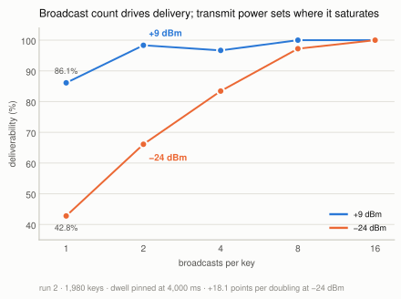
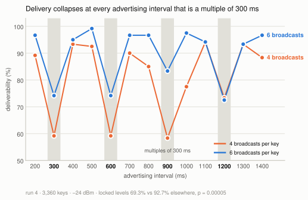
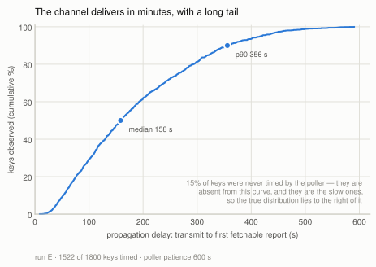
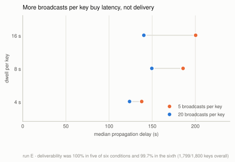
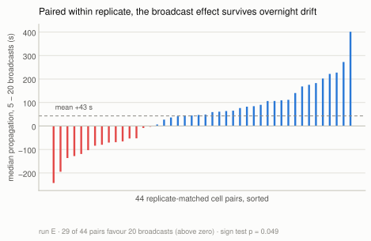
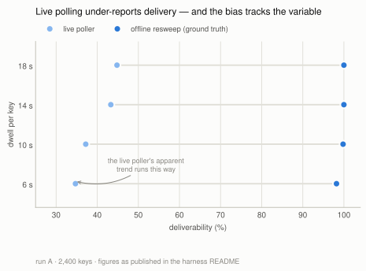

# Characterising a crowd-sourced BLE relay as a data channel

**An experimental report on the `sendmy` one-way channel**

Nguyen Thai Binh · CP2107 · August 2026

---

## Summary

`sendmy` sends data from a BLE-only device by encoding payload bytes into the
rotating public keys of a crowd-sourced location-relay network: nearby phones
observe the beacon, upload an encrypted location report keyed by the advertised
key, and the sender's owner fetches those reports back. This report
characterises that channel experimentally — how much gets through, how fast, and
which transmitter parameters matter.

Ten automated matrix runs on an ESP32 (~22,000 transmitted keys, single urban
site) support five findings:

1. **The channel is effectively lossless at urban density and full transmit
   power.** Ground-truth deliverability was 99.5%, 99.8% and 99.94% across three
   full-power runs, with **zero payload corruption in any run**.
2. **Broadcast count is what delivery depends on** — not how long a key is held
   on air. At the −24 dBm power floor delivery rises **+18.1 points per doubling**
   of broadcasts per key, from 42.8% at one broadcast to 100% at sixteen, while
   dwell from 1 s to 8 s is flat at two different power levels.
3. **Transmit power sets where that curve saturates**, rather than shifting
   delivery uniformly: +9 dBm reaches 98% by two broadcasts; −24 dBm needs eight.
4. **Some advertising intervals are simply bad.** Delivery collapses at every
   interval that is a **multiple of 300 ms** — 69.3% against 92.7% elsewhere
   (p = 0.00005) — in a comb that a coarse sweep steps straight over. The
   leading explanation is phase locking against a duty-cycled scanner.
5. **The channel's real cost is latency, not loss** — median 158 s from
   transmission to a fetchable report, p90 355 s, with a tail past 9 minutes.
   More broadcasts also buy latency: 4× more moved the median 40 s earlier.

A fifth, methodological result is arguably the most transferable: **live
detection polling systematically under-reports deliverability, and the bias
correlates with the independent variable**, manufacturing a plausible but false
parameter trend. Deliverability must be read from an offline sweep. This is
documented in §7 because it invalidated the first run's headline numbers and
changed how every subsequent run was instrumented.

---

## 1. Method

### 1.1 Harness

The board is flashed once with reconfigurable firmware that reads `run key=val`
commands over the console UART, so an entire experiment matrix runs unattended
from a single flash. Each *cell* of a matrix is one parameter combination; each
*window* within a cell advertises one payload octet under one derived carrier
key (`mid`). The two swept transmitter parameters are the **advertising
interval** (`adv_ms`, how often the radio re-broadcasts the current key) and the
**dwell** or rotation interval (`upd_ms`, how long a key is held before rotating
to the next). Their ratio fixes a third, derived quantity used throughout:
**broadcasts per key** = `upd_ms / adv_ms`.

### 1.2 Ground truth

What was sent is known two independent ways — reproduced from the cell's
parameters (all payload modes are deterministic) and parsed from the firmware's
serial log — and the harness reconciles them, warning on disagreement. What was
*received* is recovered by fetching reports for each key.

**Deliverability is always taken from an offline resweep**, not from the live
poller, for the reasons in §6. The resweep re-fetches every key after the run
with no queue pressure and a generous time window.

### 1.3 Controls

- **Per-cell UIDs.** Every cell gets a fresh 32-byte Unilink ID, so cells cannot
  contaminate each other's key space.
- **Interleaving.** Cells are ordered round-robin across conditions, so a block
  of *k* consecutive cells covers all *k* conditions once. Overnight drift in
  ambient device density is therefore balanced across conditions rather than
  confounded with them.
- **Density logging.** A parallel BLE scanner samples ambient finder density
  throughout each run, so "the network was empty" can be distinguished from "the
  network dropped it."
- **Cell-clustered inference.** A cell's 20 keys are not independent samples, so
  significance tests are permutation tests at the cell level, or paired tests on
  cell-level medians.

### 1.4 Runs

| Run | Cells × windows | Swept | Duration |
|---|---|---|---|
| A. Throughput | 120 × 20 = 2400 | dwell 6/10/14/18 s @ adv 1 s | overnight |
| B. TX × rotation | 120 × 20 = 2400 | TX −12…−24 dBm × rotation 4/8/16 s | overnight |
| C. Advertising | 120 × 20 = 2400 | adv 100…4000 ms @ dwell 8 s | ~5.4 h |
| D. Static soak | 3 × 110 min | nothing (continuity probe) | ~5.5 h |
| E. Dwell factorial | 90 × 20 = 1800 | dwell 4/8/16 s × broadcasts 5/20 | ~4.9 h |
| 1. TX × dwell | 98 × 20 = 1960 | TX {+9, −24 dBm} × dwell 2/4/8 s | ~2.7 h |
| 1b. TX × dwell, no antenna | 98 × 20 = 1960 | same, antenna removed | ~2.7 h |
| 2. Broadcasts × TX | 99 × 20 = 1980 | broadcasts 1/2/4/8/16 × TX {+9, −24 dBm} | ~2.8 h |
| 3. Sub-4 s dwell | 165 × 20 = 3300 | dwell 1/2/3/4/6 s @ −24 dBm | ~4.5 h |
| 4. Fine `adv` sweep | 168 × 20 = 3360 | adv 200…1400 ms × broadcasts {4, 6} @ −24 dBm | ~4.9 h |

Runs A–E are the exploratory corpus; runs 1–4 are a controlled **series** sharing
one instrument configuration and a common anchor condition (`a###_ref`,
~7–10% of every run), which is what makes them comparable across nights. Anchors
read 99.4 / 99.4 / 100.0 / 99.6% in runs 1–4 — the instrument check that licenses
pooling. Runs 1b, 2, 3 and 4 are the only ones with a full-power *and* an
attenuated arm, and that headroom is why they can see effects that runs A–E,
saturated at ceiling, could not.

---

## 2. The channel is effectively lossless at urban density

Ground-truth deliverability, offline resweep:

| Run | Keys | Delivered | Deliverability |
|---|---|---|---|
| A. Throughput | 2400 | 2388 | 99.5% |
| C. Advertising | 2400 | 2395 | 99.8% |
| E. Dwell factorial | 1800 | 1799 | **99.94%** |
| B. TX × rotation (attenuated) | 2400 | 2169 | 90.4% |

Run E's full 3 × 2 factorial:

| dwell \ broadcasts per key | 5 | 20 | row |
|---|---|---|---|
| 4 s | 300/300 | 300/300 | 100% |
| 8 s | 300/300 | 300/300 | 100% |
| 16 s | 299/300 | 300/300 | 99.83% |
| **column** | **99.89%** | **100%** | **99.94%** |

One key lost out of 1800, across every condition, over five hours. Separately,
**every delivered payload was byte-correct** — 1799/1799 in run E, and no
correctness failure has been observed in any run. The relay does not silently
corrupt; a key either comes back or it does not.

The consequence for the rest of this report is that **every transmitter
parameter swept turned out not to matter for delivery at this density**. That is
the finding, not an absence of one: the constraint on this channel is not the
radio link. But it also means the runs are saturated, and the interesting
regimes — sparse density, weak signal, sub-second dwell — sit outside what has
been measured (§8).

---

## 3. Broadcast count drives delivery; power sets where it saturates

Runs A–E could not answer what delivery depends on, because at full transmit
power every condition sat at ceiling. Run 2 re-ran the question with headroom:
dwell pinned at 4,000 ms throughout, broadcasts per key stepped 1 → 16 by
varying `adv`, crossed with transmit power at {+9, −24 dBm}.



*Figure 1 — At the −24 dBm power floor delivery climbs from 42.8% to 100% across
the broadcast axis. At +9 dBm the same curve is already saturated by two
broadcasts. Dwell is constant everywhere on this plot.*

| broadcasts/key | 1 | 2 | 4 | 8 | 16 |
|---|---|---|---|---|---|
| +9 dBm | 86.1% | 98.3% | 96.7% | 100% | 100% |
| −24 dBm | 42.8% | 66.1% | 83.3% | 97.2% | 100% |

**+18.1 points per doubling at −24 dBm, +4.0 at +9 dBm, both p < 0.0001.**

This closes the project's central confound. An earlier run had reported
80 / 92 / 99% at 4 / 8 / 16 s of dwell and attributed the effect to dwell — but
it pinned `adv` at 2,000 ms, so its dwell levels were simultaneously 2 / 4 / 8
broadcasts per key. Run 2's −24 dBm arm reproduces that curve at 66 / 83 / 97%
from broadcast count alone, with dwell held fixed. Meanwhile runs 1 and 3 moved
dwell with broadcasts pinned and found it flat from 1 s to 8 s, the second time
at ~50% delivery where a ceiling cannot explain the flatness.

**Transmit power does not shift the curve, it sets where the curve saturates.**
This also narrows an earlier "TX power does not matter" result, which swept only
−12…−24 dBm with no full-power arm and so measured flatness *inside the
attenuated tail* (§8).

**Operating point: at least 8 broadcasts per key; 16 for full delivery at the
power floor.**

---

## 4. Some advertising intervals are simply bad

Run 3 swept dwell below 4 s at −24 dBm and found no floor — 1 s dwell was the
*best* level at 91.7%, killing the scan-duty-cycle hypothesis it was built on.
But the result was non-monotone, and regrouping by advertising interval split it
exactly: `adv` ∈ {200, 400, 800} delivered 90.7% against 68.1% at {600, 1200},
a 22.6-point gap at p < 0.0001. That design pinned `adv = dwell/5`, leaving the
two perfectly confounded, so run 4 separated them: `adv` swept 200–1400 ms in
100 ms steps, crossed with **two** broadcast counts, 4 and 6.



*Figure 2 — The penalty is periodic, not a single resonance, and it lands at the
same advertising intervals in both broadcast arms.*

| | deliverability | keys |
|---|---|---|
| `adv` ∈ {300, 600, 900, 1200} | **69.3%** | 665/960 |
| all other `adv` | **92.7%** | 2003/2160 |

**23.5 points, p = 0.00005** (cell-clustered permutation, 20,000 shuffles),
present independently in both arms: 62.5% vs 89.3% at 4 broadcasts, 76.0% vs
96.2% at 6.

**It is an advertising-interval effect, not a dwell effect.** Because
`broadcasts = dwell / adv`, only two of the three can be fixed; running two
broadcast counts makes dwell differ between the arms at any given `adv`
(4 broadcasts: 1200/2400/3600/4800 ms; 6 broadcasts: 1800/3600/5400/7200 ms).
A dwell-driven penalty would therefore appear at *different* `adv` in each arm.
It does not — it lands on the same comb in both. Run 3's 600 and 1200 ms dips
were two points on that comb.

**Leading hypothesis: phase locking against a duty-cycled scanner.** Not channel
aliasing — in legacy BLE one advertising *event* transmits on channels 37, 38
and 39 within a few milliseconds, so a scanner parked on any one channel hears
every event, and channel rotation cannot produce a comb. What can is
commensurability with the scanner's **scan interval** `S`. Relays duty-cycle:
a scan window inside a scan interval. If `adv` is an exact multiple of `S`, every
advertising event lands at the same phase relative to that window, so a phase
falling in dead time means the scanner never hears the device for the whole
dwell, however many events are sent. Taking `S` = 300 ms, the number of distinct
phases visited is `S / gcd(adv, S)`:

| `adv` | `gcd(adv, 300)` | phases visited | observed |
|---|---|---|---|
| 300, 600, 900, 1200 | 300 | **1** | **penalised** |
| 200, 400, 500, 700, 800, 1000, 1100, 1300, 1400 | 100 | 3 | clean |

One free parameter fits all thirteen levels. It predicts the arm difference too:
the BLE spec's mandatory 0–10 ms random `advDelay` per event gives the phase a
slow random walk, so more broadcasts mean more chances to escape a dead phase —
which is why 6 broadcasts beats 4 at precisely the penalised levels and nowhere
else. And it contradicts nothing already measured: run C swept `adv` at
100/250/500/1000/2000/4000 ms, whose gcds with 300 are 50 or 100, so it stepped
over every bad interval by luck and concluded "duty cycle is nearly free" —
true at those six intervals, false in general.

**This is a hypothesis, not a finding**, and two things limit it. The 100 ms grid
means `gcd(adv, 300)` is only ever 100 or 300, so the sweep distinguished
"1 phase" from "3 phases" and could not measure a gradient. And an alternative
reading is that the ESP32 controller's `advDelay` randomisation is weak or
absent, which would make locking permanent rather than escapable — a property of
this transmitter rather than of the relay network, which changes how far the
result generalises. A test for overdispersion at penalised levels was
inconclusive (3.03× binomial against 3.74× at clean levels), as expected once 20
keys are pooled across many scanners with independent phases. §9 lists the three
levels that would settle it.

**Practical rule, combined with §3: use at least 8 broadcasts per key, and never
choose an advertising interval that is a multiple of 300 ms.** Neighbouring
intervals are fine — 500 ms and 1100 ms both clear 92% at a broadcast count
where 600 ms and 1200 ms fail.

---

## 5. The cost is latency, and it is heavy-tailed

Define **propagation delay** as the interval from transmitting a key to the
moment a report for it first becomes fetchable. This is the channel's true
end-to-end delay, and it is the quantity a system built on `sendmy` must design
around.



*Figure 3 — Propagation delay, cumulative. Run E is the usable estimate; run C's
curve is truncated by its poller, not by the network.*

Run E, over the 1522 keys the poller timed:

| min | p25 | **p50** | p75 | **p90** | p99 | max |
|---|---|---|---|---|---|---|
| 9 s | 89 s | **158 s** | 265 s | **355 s** | 504 s | 591 s |

So the channel is ~100% reliable but delivers on the order of **minutes**, with
a tail running past 9 minutes. Half of all keys need more than 2.5 minutes; one
in ten needs more than 6.

**Cross-run comparison of this distribution is invalid**, and the figure shows
why. Run C's measured propagation looks much faster (median 91 s, max 334 s),
but its poller gave each key only 300 s of patience — the distribution is
**right-censored at the dashed line**, and its apparent speed is the cut-off, not
the network. Run E's 600 s patience is the less-censored estimate, and even it is
truncated at 591 s: the true tail is longer than measured. Any latency figure
from this harness is a lower bound set by the poller's patience, and only
distributions gathered under identical patience may be compared.

Secondary observations from the same data: the median horizontal accuracy of the
decrypted location fixes was 87 m, and delivered goodput at these settings ranged
from 3.7 keys/min (16 s dwell) to 14.8 keys/min (4 s dwell) — 0.062 to
0.246 bit/s, which frames the channel's realistic scale.

---

## 6. Broadcast count also buys latency

Run E was designed to separate two variables that prior runs had confounded: how
*long* a key is on air (dwell) and how *often* it repeats (broadcast count). It
crossed dwell 4/8/16 s with broadcasts-per-key 5/20, scaling `adv_ms` with dwell
so that the broadcast count is held constant *within* each dwell level — an
iso-broadcast design. 15 replicates per condition, round-robin interleaved.

Delivery, as §2 shows, was at ceiling in all six conditions, so the design could
not discriminate on its primary endpoint. It discriminated cleanly on latency:



*Figure 4 — At every dwell level, more broadcasts per key means a lower median
propagation delay, while delivery stays pinned at the ceiling.*

| | broadcasts = 5 | broadcasts = 20 |
|---|---|---|
| median propagation | 178 s | **138 s** |
| poller coverage (by dwell 4/8/16 s) | 66 / 81 / 92% | 85 / 97 / 87% |

- Pooled per-key: **Δ median = 40 s**, permutation test **p < 0.0001**.
- Paired by replicate on cell medians (which removes overnight drift entirely):
  29 of 44 pairs favour the denser broadcast, mean Δ 43 s, **sign test
  p = 0.049**.



*Figure 5 — The paired test in full. The effect is a shifted distribution, not a
uniform one: 15 of 44 pairs run the other way, and the mean is carried partly by
a long positive tail.*

The censoring in §5 works *against* this effect: the sparse arm loses more of its
slow tail to the poller cut-off, which biases its measured median *downward*. So
40 s is a floor on the true difference.

Dwell showed no clean latency ordering (medians 131 / 175 / 166 s at 4 / 8 / 16 s;
8 vs 16 s, p = 0.40), and in this design dwell co-varies with `adv_ms` by
construction, so no dwell effect on latency should be read from it.

**Interpretation.** *In this run* more broadcasts did not make delivery more
likely — they made it happen sooner, by raising the chance that a *passing*
finder intersects a broadcast early in the key's dwell window rather than late.
The "not delivery" half of that is now known to be a ceiling artifact: run E was
conducted at full transmit power, where delivery is saturated and cannot move.
Given headroom, broadcast count moves delivery hard (§3). The latency result
below stands; read it as *broadcast count buys latency as well as delivery*. This is a useful
separation, because deliverability and latency are routinely conflated when
tuning BLE beacons, and here they respond to different knobs. It also partially
contradicts run C, which reported no latency ordering with `adv_ms`; run C read
latency per level rather than paired, and its distribution was censored at 300 s,
so it was poorly placed to see a 40 s shift.

---

## 7. Methodological result: live polling lies

The first run (A) produced a clean, plausible, and entirely false result.

Its live poller — fetching every 30 s and abandoning a key once
`now − send_time > lost_timeout · queue_soft_cap / queue_size` — reported 40.0%
deliverability, rising monotonically with dwell:

| dwell | live | **true (offline)** |
|---|---|---|
| 6 s | 34.7% | 98.2% |
| 10 s | 37.2% | 99.8% |
| 14 s | 43.3% | 100% |
| 18 s | 44.8% | 100% |
| **all** | **40.0%** | **99.5%** |



*Figure 6 — The gap between the two measurements is the artifact. It is widest at
the shortest dwell, which is exactly where the hypothesis under test predicted a
real deficit.*

True deliverability was 99.5% and flat. The live figure was a sampling artifact:
the adaptive timeout collapses under backlog (queue of 40 → 144 s effective
patience; queue of 60 → 96 s) to well below the real p90 propagation of ~256 s,
so slow-but-real keys were abandoned before their reports existed. The live
poller logged *zero* detections for 18 of 120 cells; the offline resweep
recovered ~20/20 for every one of them.

Critically, **the bias was correlated with the independent variable**. Short
dwell packs more keys per unit time, so it produced the largest queue backlog and
the worst under-count. The artifact therefore ran in exactly the direction a
"longer dwell delivers better" hypothesis predicts, and it would have been
reported as a real effect had the offline sweep not been run.

The general form of this failure — *the instrument's timeout is shorter than the
phenomenon's tail, and the load that shortens the timeout is the thing being
varied* — is not specific to this protocol. Any adaptive-timeout measurement of a
heavy-tailed process is exposed to it.

The fix was a **two-tier poller** (a fast tier for propagation timing, a slow
sweep for deliverability) plus a mandatory offline resweep for ground truth.
Validation: in run C, live and offline deliverability agreed to within one key at
every level, and run E's live and offline counts agreed exactly.

---

## 8. Corrections to earlier conclusions

Four claims from earlier in this project have been narrowed or withdrawn.
Recording them is part of the result.

**"Dwell, not broadcast rate, is what delivery depends on." — withdrawn, and
inverted.** It rested on comparing 4 s dwell at 80% against 8 s dwell at 99%
*across different runs, nights and densities*, in a design where `adv` was pinned
so dwell and broadcast count moved together. Run 2 separated them and found
broadcast count carries the effect (§3); runs 1 and 3 moved dwell with broadcasts
pinned and found it flat from 1 s to 8 s at two power levels.

**"TX power does not matter." — narrowed.** Run B swept −12 to −24 dBm and found
deliverability flat (p = 0.94), but *every arm was attenuated*, so it established
flatness **within the attenuated tail**. With a full-power arm added, +9 dBm
delivers 96.1% against −24 dBm's 89.0% (p = 0.0009), and the mechanism is
saturation of the broadcast curve rather than a uniform shift.

**"Radio duty cycle is nearly free." — narrowed to the levels it tested.** Run C
found ~100% delivery across `adv` 100–4000 ms, but every level it sampled is
coprime enough with 300 ms to avoid the comb (§4). The claim is true at those six
intervals and false in general.

**"Antenna removal can serve as an attenuation dial." — withdrawn.** Run 1b
repeated run 1 with the antenna off and found a regime switch, not a dial:
0 of 900 keys delivered at −24 dBm against 49.8% at +9 dBm. Attenuation must come
from the PA setting with the antenna fitted.

A methodological correction belongs here too. **Deliverability must be read from
an offline resweep, and the resweep must be run at least 2 hours after
transmission ends.** Run 4's first sweep was launched about a minute after the
final cell and reported 29.6% for keys sent in the last hour, against 87–91% for
everything older; re-swept at +3.1 h the same keys read 76.1% while every older
bucket returned byte-identical counts. Earlier runs swept at +1.3–1.7 h and carry
a residual few-point bias confined to their final cells.

---

## 9. Limitations and future work

**Limitations.** Single site, single receiver network, **single transmitter**,
ambient density 6–31 finders across the corpus. Every result is therefore "at
urban Singapore density," measured on one ESP32. The channel under genuine
scarcity has still not been characterised — the one axis the corpus never
manipulated is the finder population itself. Latency figures are lower bounds set
by poller patience (§5). Diurnal drift is balanced by interleaving, not
controlled, and board position is an uncontrolled covariate that the anchor cells
can detect but not attribute.

**Settling the comb.** §4's scan-locking model makes sharp predictions, and three
`adv` levels would separate it from the alternative that the transmitter's own
`advDelay` randomisation is at fault. In order of value:

1. **`adv` = 450 ms** — the clean discriminator between a 300 ms scan interval
   and a 150 ms one. If `S` = 300, `gcd` = 150 → 2 phases → an *intermediate*
   penalty. If `S` = 150, 450 ms is fully locked → a severe one. One level
   separates the two models.
2. **Off-grid levels 150 / 250 / 350 ms** — the current grid cannot show a
   gradient because every level is a multiple of 100. The model predicts 250 and
   350 ms (gcd 50, 6 phases) are the cleanest cells in the matrix and 150 ms
   (2 phases) falls between locked and clean.
3. **A locked interval at high broadcast count — `adv` 600 ms at 16 broadcasts.**
   The random-walk escape story predicts the penalty largely *disappears*, since
   16 events give the phase enough steps to find the scan window. If it persists,
   `advDelay` is implicated and the finding concerns this radio rather than the
   network. Most consequential of the three: it decides whether the rule is
   "avoid multiples of 300 ms" or "avoid them only below ~8 broadcasts per key".

Extending the comb to 1500 / 1800 / 2100 ms would confirm the periodicity
continues, but every resonance model predicts that, so it is the least
informative. Worth noting that the comb was measured only at −24 dBm; whether it
survives at full power, where delivery is otherwise saturated, is untested and
matters for whether it constrains real deployments.

**Density** (`matrix.density.json`, built, unrun). Three conditions — the anchor
plus two deliberately fragile ones at 4 and 2 broadcasts per key — over ~6 h,
which is what turns "we never saw the cliff" into a quantified threshold. It
needs a venue the current site cannot provide: that site reads 10.6–13.5 mean
finders across the whole day with within-hour scatter of 3–23, so its noise is
several times its diurnal signal and any run there yields a flat line. The
requirements are range wide enough to move the 2-broadcast condition, regimes
persisting 30+ minutes so whole interleaving blocks fit inside one, and ideally a
low → high → low reversal, since a monotone ramp leaves density confounded with
elapsed time.

**A second transmitter.** Every result here comes from one board. The comb in
particular would be far stronger if it reproduced on different hardware, because
that is exactly what separates a relay-network property from an ESP32 controller
property — and that distinction is currently the largest open question in the
report.

**Sub-floor attenuation.** Probing the genuine weak-signal cliff needs an inline
RF attenuator or characterised shielding; the −24 dBm PA floor still delivers
89%, and antenna removal is a regime switch rather than a dial (§8).

---

## Appendix: reproducing the analysis

```sh
cd examples/espbench

# run a matrix (unattended; board flashed once)
python3 run_matrix.py matrix.dwell_isobroadcast.json

# authoritative deliverability — never use the live poller's counts
python3 scripts/resweep.py results/<run>/

# cell-clustered significance tests
python3 scripts/analyze.py   results/<run>/
python3 scripts/analyze2d.py results/<run>/ --resweep --final

# regenerate every figure in this report (SVG + 200 dpi PNG)
scripts/.venv/bin/python scripts/plot_report.py
```

Host dependencies are pinned in `scripts/requirements.txt`
(`scripts/.venv/bin/python -m pip install -r scripts/requirements.txt`).
Figures 1–4 are derived directly from the run artifacts; figure 5 uses run A's
published figures, since that run's artifacts were not retained.

Per-run artifacts: `summary.json` (per-key detail, including every report's
timestamp, decrypted fix and propagation latency), `summary.csv` (per-cell
aggregates), `resweep.csv` (ground-truth deliverability), `density.csv` (ambient
finder density time-series), `detection.csv` / `deliverability.csv` (raw poller
series). Full harness documentation is in `examples/espbench/README.md`.
